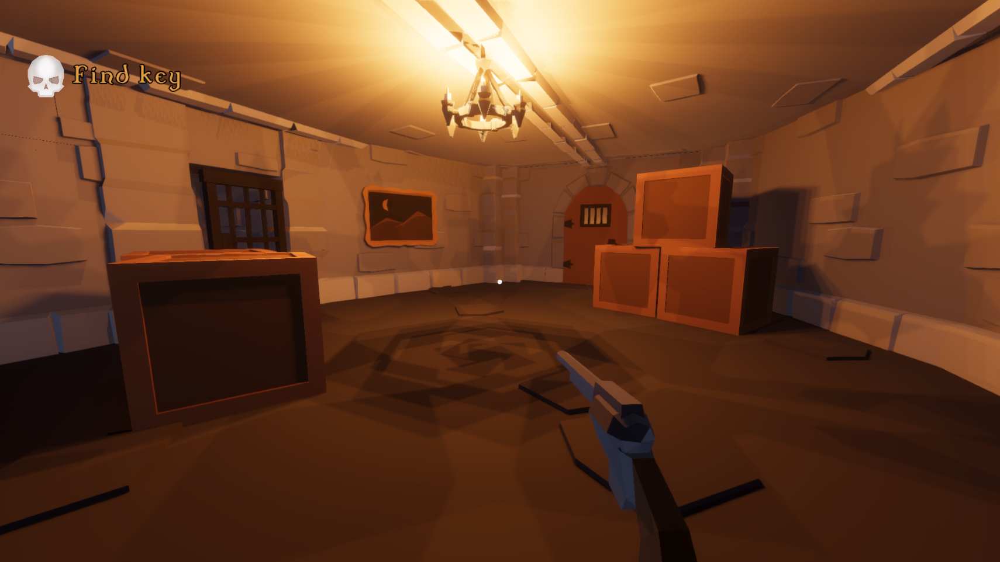
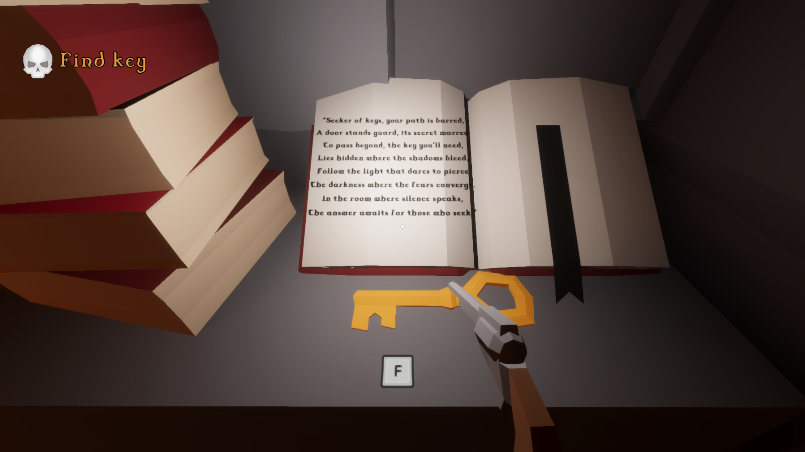
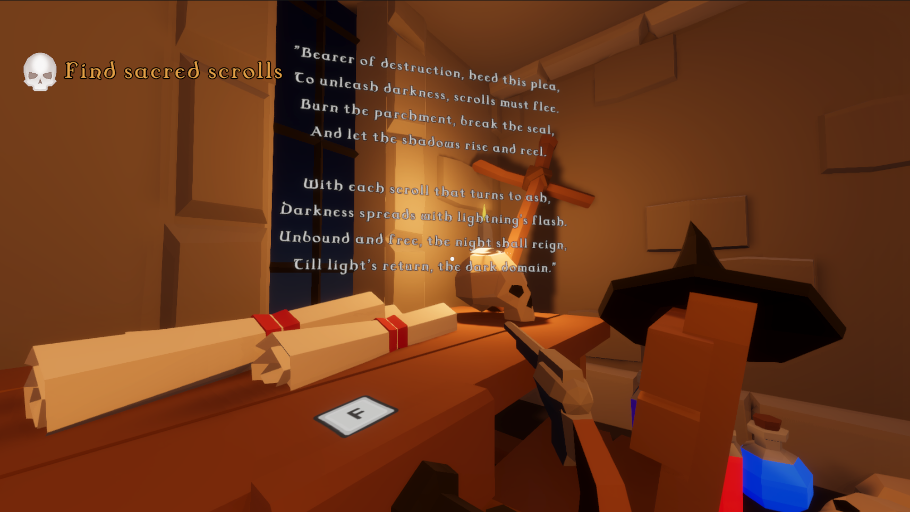
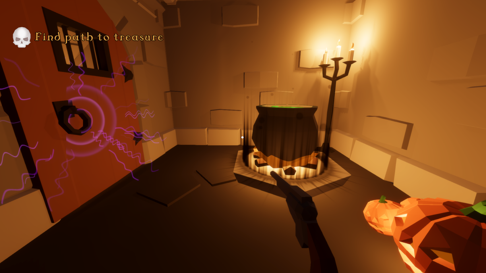
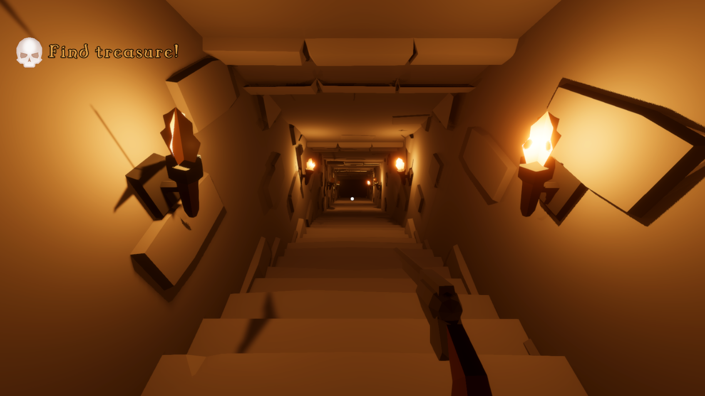
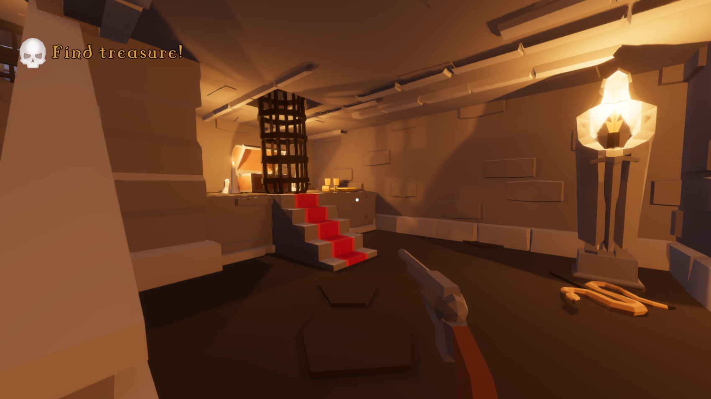
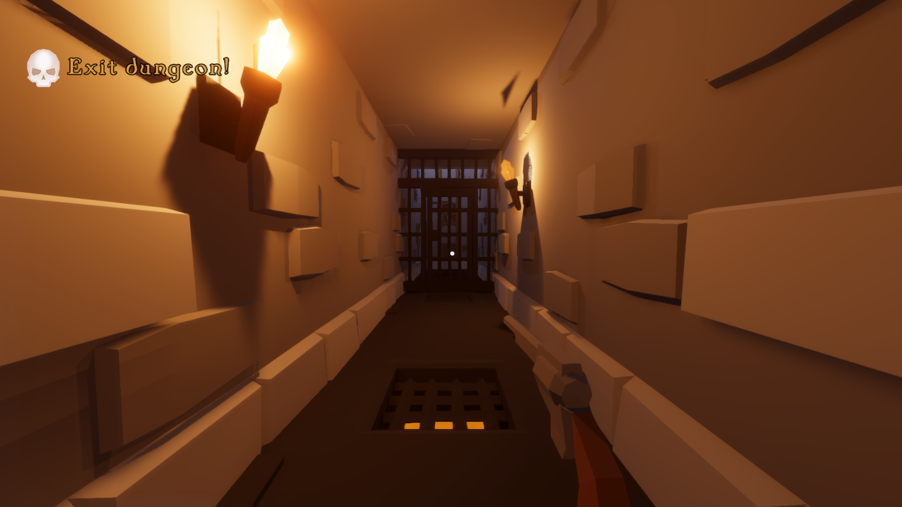

# Dungeon Level Design
Designed a level from differenc phases from paper design, white-boxing to mesh pass, and lighting pass with scripted playable build to test out the mission to exit the dungeon with witty hints and small puzzles.

## Screenshots

## License
[MIT](https://choosealicense.com/licenses/mit/)
